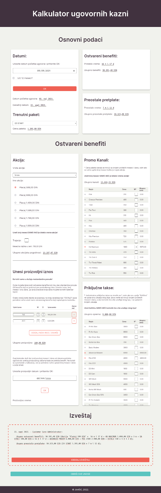

# README - Kalkulator penala (Early Cancellation Fee Calculator)

A calculator of early cancellation fee for a broadband. Built with vanilla javaScript and used in real world. :)

It's built to be super easy to add your own products, should you wish to use this calculator for your purposes.

## Table of contents

- [Overview](#overview)
  - [Description](#description)
  - [Screenshot](#screenshot)
  - [Links](#links)
  - [Features](#features)
  - [Usage](#usage)
  - [Edit with your data](#edit-with-your-data)
- [The process](#the-process)
  - [Built with](#built-with)
  - [Further development](#further-development)
  - [Useful resources](#useful-resources)
- [Author](#author)

## Overview

### Description

Cancelling service while still within the minimum contractual term may result in early cancellation fee (sometimes also called early termination fee). Companies usually calculate this fee by multiplying monthly charge with the remaining number of months, but things are a bit more complicated where I live. Here we do the following:

- Add up all the benefits that customer got by signing the contract. These may include price reduction, extra channels, free device etc.
- Multiply monthly subscription with the remaining number of months.

This gives us two different ammounts. The lesser number is the actual fee the customer has to pay in case of early cancellation. If a customer hasn't received any benefits by signing the contract (so the first number is zero), the contract can be cancelled without any penalties.

My company offers a big variety of benefits for signing a contract, so things can get quite complicated when calculating early cancellation fee, which is why I've build this app. With it, my team does the calculation about ten times faster than before. The app also generates a report for easily presenting the calculations to the customer.

### Screenshot

### Links

- [Repo](https://github.com/je-jo/kalkulator-penala)
- [Live Site](https://kalkulator-penala.netlify.app/)

### Features

- The calculator works for 12 and 24 months contracts and is based on a 360-day calendar year with 12 30-day months.
- Generates a report for easy presentation to the customer. The report is also editable.
- Has built-in support for custom entries. If the customer has received a benefit that is not included in the app, or that has ended prematurely (happens because of system error), you can simply enter the ammount and the number of months and days. Such entries are added to the end of report as "MISC.". 
- While the app is meant to be used in office setting, it is responsive, because I like the mobile-first approach. This means you can calculate your customers' fees on the go! :)

### Usage

- Enter the contract start date. For 12-month contracts, tick the appropriate box, otherwise the app calculates 24-month contracts by default.
- Choose a rate plan. The app automatically calculates total remainder of monthly paychecks.
- If the customer has gained a price reduction benefit, choose a benefit type (percentage, previous rate plan price...).
- If the customer has gained extra channels or other product package benefits, tick the appropriate boxes.
- If the customer has gained a free device or other hardware related benefits, tick the appropriate boxes.
- If the customer has gained a benefit not included in the app, enter the appropriate ammounts, months and days.
- After you have ticked all the benefits the customer gained, click "Generate Report" button. The report can be edited and copied.
- To calculate next customer's fee, click "Clear all entries" and/or refresh the page.

### Edit with your data

You don't have to be a coder to edit the app with your own data. All the relevant easily editable bits are at the top of the "script.js" file.

- To edit the date and currency formats, change the formatPrice() and formatDate() functions at the very top of the file. Here are some links to help you find the format you need.

  - [Format Date](https://developer.mozilla.org/en-US/docs/Web/JavaScript/Reference/Global_Objects/Date/toLocaleString)
  - [Format Number](https://developer.mozilla.org/en-US/docs/Web/JavaScript/Reference/Global_Objects/Number/toLocaleString)

- To edit the company products, you need to edit the arrays called "ratePlans", "productPackages" and "hardwareItems". Add your own objects in the appropriate array. The objects must follow this format:

`constructPlan("item-name", 123, 0, 0),`

Substitute "item-name" with your product name (quoted, lower case, dashes instead of spaces), 123 with your product price, and don't delete the two zeros.

## My process

### Built with

- Semantic HTML5 markup
- CSS custom properties
- CSS Grid
- Flexbox
- Mobile-first workflow
- Vanilla javaScript.

### Further development

- Add the percentage and reduced price benefits in js file. Currently they are "hard-coded" in html and can only be edited from there.
- This might be a good candidate for a multi-step form.

### Useful resources

Too many things going on here, so I can only link to my two main learning resources. I'm sure there are better, cleaner and more advanced ways to achieve the functionality of this app, but I'm happy to be able to build an actual useful thing with the knowledge I currently possess. Everything I know about javaScript is from these two platforms:

- [The Odin Project](https://www.theodinproject.com/)
- [freeCodeCamp](https://www.freecodecamp.org/)

The scissors favicon is from here:
- [favicon.io](https://favicon.io/)

## Author

- [Github](https://github.com/je-jo)
- [Frontend Mentor](https://www.frontendmentor.io/profile/je-jo)
- [Codepen](https://codepen.io/je-jo)
- [Twitter](https://twitter.com/jelena_jo_)